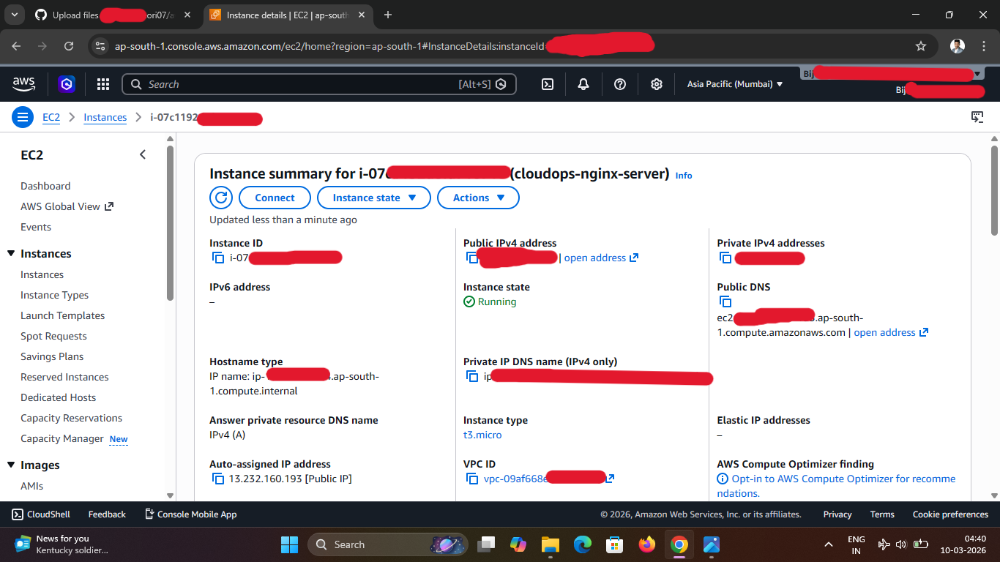
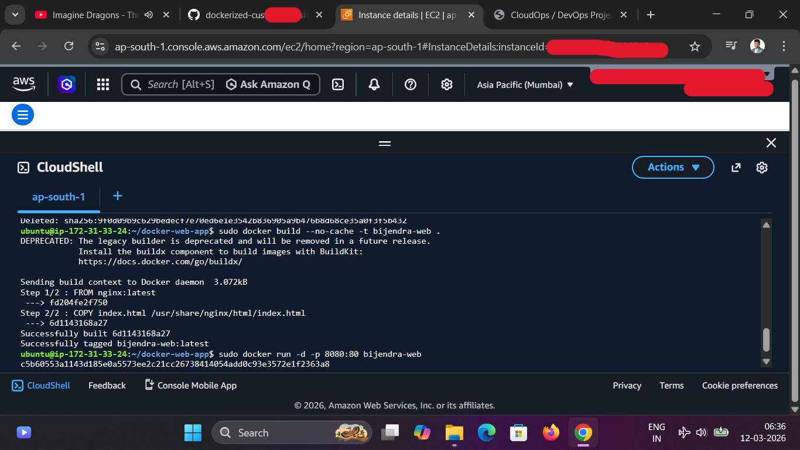
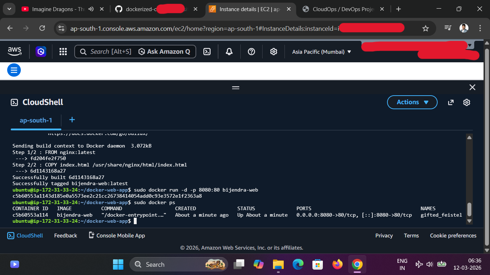
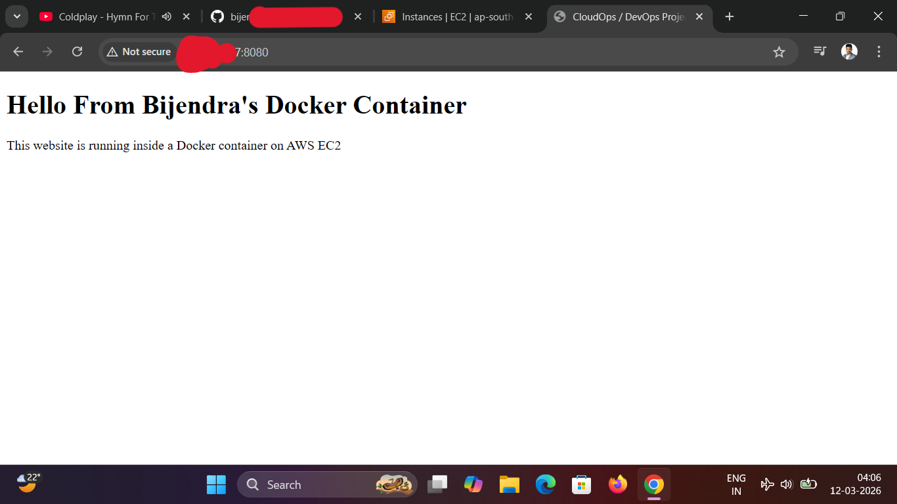

# Dockerized-Custom-Website deployment on AWS EC2
## Project Overview
This project demonstrates how to deploy a custom static website inside a docker container running on an AWS EC2 instance.
The goal was to practice containerization, cloud deployment and Linux-based server management, which are core skills in CloudOps and DevOps environments.
The application is built using a simple HTML page, containerized using Docker and served through Nginx inside the container
## Architecture 
```
       Developer 
           ↓
   GitHub Repository
           ↓
AWS EC2 Instance (Ubuntu Server)
           ↓
Dockerfile + index.html
           ↓
     Docker Build
           ↓
  Docker Image (Nginx)
           ↓
   Docker Container
           ↓
Browser Access (Public IP:8080)
```
## Technologies Used
```
- AWS EC2
- Docker
- Nginx
- Linux(Ubuntu)
- GitHub
- HTML
```
## Project Structure
```
dockerized-custom-website
  ├────── Dockerfile
  ├────── index.html
  ├────── Readme.md
  └────── screenshots
            ├───── ec2-instances.png
            ├───── docker-build.png
            ├───── docker-run.png
            └───── website-output.png
```
## Application Code
### index.html
```
<html>
<head>
<title> CloudOps / DevOps Project</title>
</head>
<body>
<h1> hello From Bijendra's Docker Container</h!>
<p>This website is running a docker container on AWS EC2</p>
</body>
</html>
```
### Dockerfile 
```
FROM nginx:latest
COPY index.html usr/share/nginx/html/index.html
```
This Dockerfile performs the following actions:
1. Pulls the official Nginx base image
2. Copies the custom index.html into Nginx default web directory
3. Serves the custom webpage through the Nginx server
## Deployment Steps
1.  Launch AWS EC2 instances
   - Ubuntu Server
   - Configure Security Group
   - Allow SSH (22) and HTTP/Custom port 8080
2. Connect to the server
```
ssh -i <key.pem> ubuntu@<ec2-public-ip>
```
3. Install Docker
```
sudo apt update
sudo apt install docker.io -y
sudo systemctl start docker
sudo systemctl enable docker
```
4. Build Docker Image
```
docker build -t bijendra-web .
```
5. Run Docker Container
```
docker run -d -p 8080:80 bijendra-web
```
This maps:
```
EC2 Port 8080 → Container Port 80
```
6. Verify Running Containers
```
docker ps
```
7. Access Website
Open in browser:
```
http://<ec2-public-ip:8080>
```
## Deployment Result
The custom webpage successfully loads from the docker container running on AWS EC2.
Expected Output:
```
Hello From Bijendra's Docker Container
This website is running inside a Docker Container on AWS EC2
```
## Screenshots
Screenshots included in the repository demonstrate:
- EC2 instance configuration



- Docker image build



- Running Docker Container



- Website output in browser



## Skills Demostrated
### CloudOps Skills
- AWS EC2 instance management
- Server access via SSH
- Security Group Configuration
### DevOps Skill
- Docker containerization
- Writing Dockerfile
- Container deployment
- Web server deployment using Nginx
### Linux Skills
- Package installation
- Process management
- File System operations

## Container Lifecycle Management
During deployment testing, the container was rebuilt to ensure the updated website content was correctly served from the Docker image.
To apply the updated configuration and web files, the existing container was stopped and removed before rebuilding the image.
### Stop Running Container
```
sudo docker stop $(sudo docker ps -q)
```
### Remove Container
```
sudo docker rm $(sudo docker ps -aq)
```
### Remove Existing Docker Image
```
sudo docker rmi bijendra-web
```
### Rebuild Docker Image
```
sudo docker build --no-cache -t bijendra-web .
```
### Run Docker Container
```
sudo docker run -d -p 8080:80 bijendra-web
```
This process ensures that the latest application code and Docker configuration are properly deployed
## Key Learning Outcomes
- Understanding how containerization works in real deployment
- Running web applications inside Docker containers
- Deploying containers on cloud infrastructure
- Troubleshooting deployment issues in Linux environments

## Author
Bijendra Kumar Deori

Aspiring CloudOps | Aspiring DevOps |
